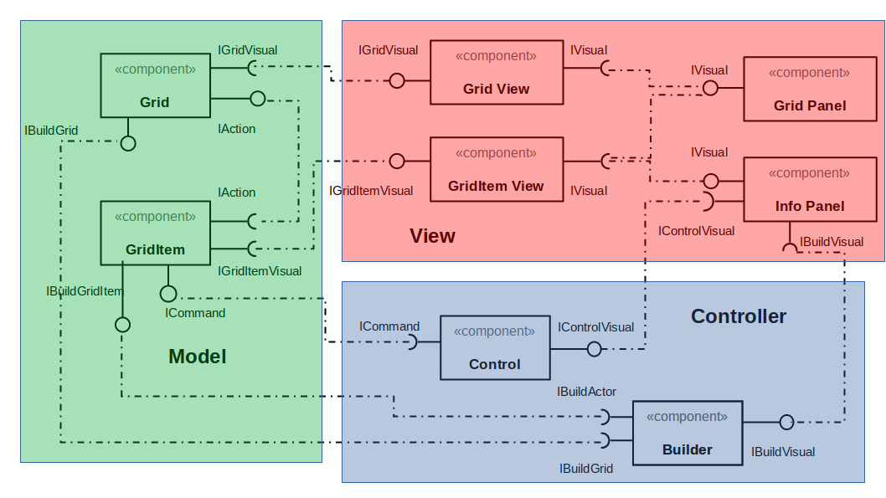

# Projeto Final MC322 - OceanFox

## Descrição

Neste projeto realizaremos a implementação de um jojgo em linguagem Java. O OceanFox foi desenvolvido em ambiente celular e tem
como principal objetivo realizar a captura do alvo (baleia).
O jogador, através de interação via teclado, realiza o deslocamento do Navio Caçador de forma a percorrer o cenário sem esbarrar
nos obstáculos ou ser atingido por um adversário.
Os adversários são compostos de dois navios piratas que lançam bombas um contra o outro, podendo atingir o Navio Caçador.

O jogo será finalizado caso o ator principal fique com um nível de energia muito baixo ou se a captura for realizada.
## Equipe
* Ana Luiza Malatesta de Pieri - 193199
* Daniel Salgado Costa - 042779
  
## Vídeo do Projeto
  
### Vídeo introdutório   
 [Clique aqui para ver o vídeo do projeto](https://youtu.be/7jJkn952Nt8)
## Slides do Projeto   
    
[Clique aqui para ver os slides do projeto](https://drive.google.com/file/d/1-5Xo7iMOnYNXLV7RXgFsevA7Z0z8p5Qr/view?usp=sharing)
  
## Documentação dos Componentes
## Diagramas  
### Diagrama Geral  
[imagem](https://docs.google.com/presentation/d/1jEmcjWWWtM5D-awFN7nWn23QsqWs9HS2jZpnAJ8xyXk/edit#slide=id.gddce5a0f9d_0_14)
<br/><br/>

<br/><br/>
No diagrama acima, podemos ver a arquitetura usado no projeto, Model-View-Controller (MVC),
 e como os componentes se comunicam entre si, além de qual parte da arquitetura os componentes pertencem.
  
## Diagrama Geral de Componentes  
### Componente  
  
<Resumo do papel do componente e serviços que ele oferece.>
Ficha Técnica
<inserir tabela conforme exemplo>
  
## Interfaces  
Interfaces associadas a esse componente:  
  
Interface agregadora do componente em Java: EXEMPLO
```java
public interface IDataSet extends ITableProducer, IDataSetProperties {
}
```
  
### Detalhamento das Interfaces  

Interface <nome da interface>
<Resumo do papel da interface.>
  
## Plano de Exceções  
[link](https://app.luminpdf.com/viewer/60cab6004b0d7000119dec9c)  
  
<Elabore um diagrama com a hierarquia de exceções como detalhado abaixo>  
  
### Descrição das classes de exceção
<Monte uma tabela descritiva seguindo o exemplo>:  
