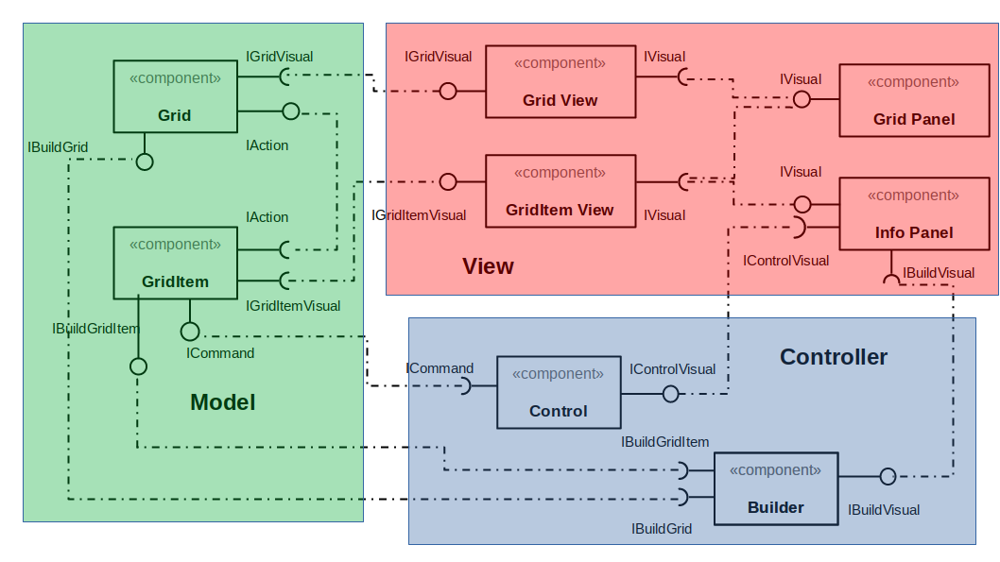

# Projeto Final MC322 - OceanFox

## Descrição

Neste projeto realizaremos a implementação de um jojgo em linguagem Java. O OceanFox foi desenvolvido em ambiente celular e tem
como principal objetivo realizar a captura do alvo (baleia).
O jogador, através de interação via teclado, utilizando as teclas 'w','a','s','d' e espaço para paralização, realiza o deslocamento do Navio Caçador de forma a percorrer o cenário sem esbarrar nos obstáculos ou ser atingido por um adversário.

Os adversários são compostos de dois navios piratas que lançam bombas um contra o outro, podendo atingir o Navio Caçador.

O jogo será finalizado caso o ator principal fique com um nível de energia muito baixo ou se a captura for realizada.
## Equipe
* Ana Luiza Malatesta de Pieri - 193199
* Daniel Salgado Costa - 042779
  
## Vídeo do Projeto
  
### Vídeo introdutório   
 [Clique aqui para ver o vídeo do projeto](https://youtu.be/7jJkn952Nt8)
 
### Vídeo do Jogo
[Clique aqui para ver o funcionamento preliminar do jogo](https://drive.google.com/file/d/1Cl_8QVt-Zg4MU9MrN0YaE5U7jtf3OXyX/view?usp=sharing)
 
## Slides do Projeto   
    
[Clique aqui para ver os slides do projeto](https://drive.google.com/file/d/1-5Xo7iMOnYNXLV7RXgFsevA7Z0z8p5Qr/view?usp=sharing)
  
## Documentação dos Componentes
## Diagramas  
### Diagrama Geral  

<br/><br/>
No diagrama acima, podemos ver a arquitetura usado no projeto, Model-View-Controller (MVC),
 e como os componentes se comunicam entre si, além de qual parte da arquitetura os componentes pertencem.
  
## Diagrama Geral de Componentes  


### Componente  
  
#### Arpao
Componente responsável pelo posicionamento e impressão do elemento Arpão no Jogo. Criado de forma a estar sempre uma posição a frente do Návio, para ser utilizado como um elemento de ataque.

Métodos existentes:
- public Arpao(double x, double y): Posicionamento da lança de ataque.
- public void atualiza(double dt): Realiza a atualização dos posicionametos a cada frame.
- public void yPositivo(): Impulsiona o arpão para cima.
- public void xPositivo(): Impulsiona o arpão para baixo.
- public void yNegativo(): Impulsiona o arpão horizontalmente para o lado negativo.
- public void xNegativo(): Impulsiona o arpão horizontalmente para o lado positivo.
- public void stop(): Faz com que o arpão pare de se movimentar.
- public void ataque(): Faz com que o arpão se movimente com uma velocidade 2x a do Navio, dando a impressão de ataque.
- public void desenhar(Tela t): Recorta a figura "ocean.png" e atualiza o seu posicionamento.

#### Baleia
É o objeto a ser caçado no jogo. Contruído de forma a ser posicionado a partir de comandos aleatórios que são gerados com o movimento do navio. Cada tecla pressionada pelo jogador gera um novo posicionamento para a baleia.

Métodos existentes:
- public Baleia(double x, double y): Posicionamento do alvo.
- public void atualiza(double dt): Realiza a atualização dos posicionametos a cada frame.
- public void y(): Cálcula posição aleatória para a baleia.
- public void desenhar(Tela t): Recorta a figura "ocean.png" e atualiza o seu posicionamento.


#### NavioPirata
Componente responsável por definir os limites de posicionamento entre navio e bomba. Realiza o cálculo da sobreposição, fazendo com que o jogo termine caso exista uma colisão, ou seja, sobreposição dos atores no mesmo espaço e tempo.

- public NavioPirata(double x0, double y0, double x1, double y1): Posicionamento do obstáculo.
- public void mover(double x0, double y0, double x1, double y1): Alteração de posicionamento a cada frame.
- public int colisaoBomba(NavioPirata bomba): Avalia posicionamento da bomba e do návio e acusa se houve uma colisão.

#### Controller
Componente responsável por realizar o controle da tela e também da entrada do jogo, ou seja, recebe a requisição de posição através do teclado e faz a comunicação com o jogo para que o movimento seja executado. Realiza novas solicitações de impressão para o elemento Tela.
Ambiente onde há a criação da janela de apresentação do jogo.

Métodos existentes:

- public Controller(Jogo j)
- private void mainLoop()
- private static String keyString(KeyEvent evt)

#### Navio
Componente com o ator principal do jogo. Resposnável por determinar o seu posicionamento a cada atualização temporal e a continua visualização do elemento na tela.

#### Obstaculo
Classe responsável pela criação e visualização das bombas que são lançadas peloas navios piratas.

#### OceanFox
Classe responsável pela implementação do jogo, onde são chamas as criações do navio, baleia, obstáculos e onde existe a leitura do teclado. 

Métodos existentes:

- public OceanFox(): Cria componentes do jogo.
- private Acao addBomba(): Adiciona obstáculos.
- public String getTitulo(): Inicializa título.
- public int getLargura(): Determina largura da tela.
- public int getAltura(): Determina altura da tela.
- public void tecla(): Recebe entrada di teclado e chama método de atualização da posição dos componentes.
- public void tique(): Atualização temporal do jogo.
- public void desenhar(): Criação do background do jogo.
- public static void main(): Chama o método de execução.
- private static void roda(): Chama o controller.

#### Tela
Componente responsável pela criação da da interface de visualização do jogo.

Métodos existentes:

- public class Tela()
- public void imagem()

#### Timer
Componente responsável pela característica de loop do jogo, de forma a realizar uma atualização temporal a cada Frame.

Métodos existentes:

-  public Timer(double limite, boolean repete, Acao acao)
-   public void eachFrame(double dt)
  
#### WinLoseGame
Componente responsável por extrair e apresentar mensagens de início e fim do jogo.

Métodos existentes:

- public WinLoseGame(double x, double y): Posicionamento na tela.
- public void atualiza(double dt): atualiza posição.
- public void fim(): caso a condição de fim seja atendida, coloca uma mensagem na tela.
- public void desenhar(Tela t): Recorta a figura "ocean.png" e atualiza o seu posicionamento.

## Interfaces  
Interfaces associadas a esse componente:  
#### Acao  

```java
public interface Acao {
    void executa();
}
```
#### Jogo
Componente de armazenamento dos principais parâmetros do jogo, sendo: largura e altura da tela, possível título, temporizador, entrada via teclado e comenado de impressão.

```java
public interface Jogo {
	 String getTitulo();
	    int getLargura();
	    int getAltura();
	    void tique(java.util.Set<String> teclas, double dt);
	    void tecla(String tecla);
	    void desenhar(Tela tela);
```
### Detalhamento das Interfaces  

Interface <nome da interface>
<Resumo do papel da interface.>
  
## Plano de Exceções  

  
